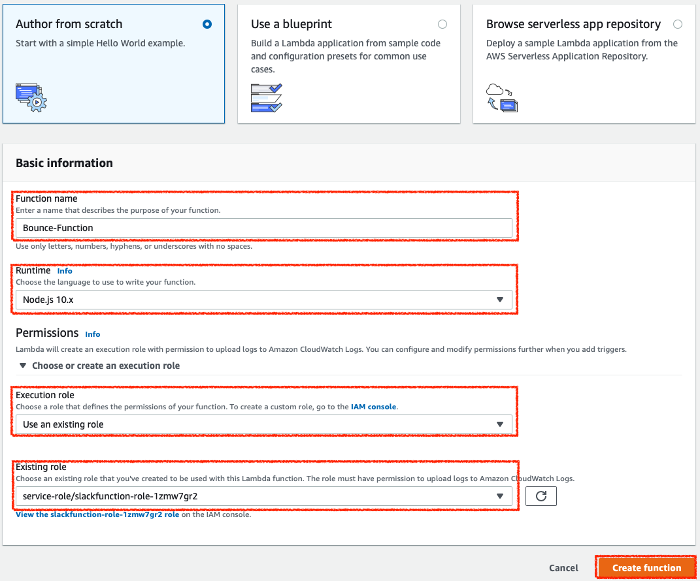
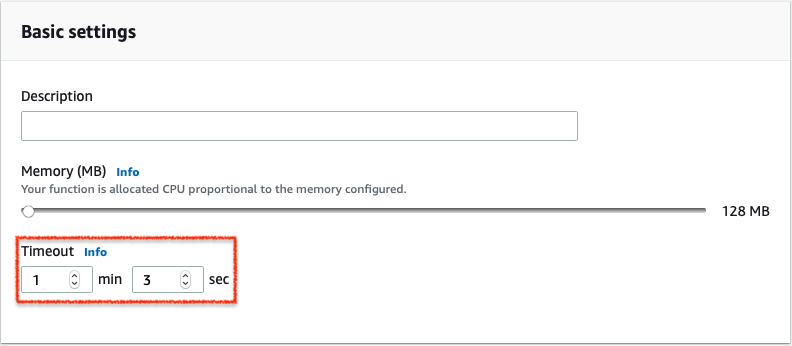

## AWS-sns-notification-to-slack-webhook
 export the messages from sns notification to slack channel


SNS 알림 메세지를 Slack Webhook을 통해 알림받기
=================================
[Go to english page](./Readme.en.md)

본 워크샵에서는 AWS의 Serverless 서비스를 통해 알림 발생, 구독, 함수를 통한 슬랙 챗봇 사용 등 인프라 운영 및 모니터링에 필요한 시스템을 구현 해 봅니다.

이 실습은 [Amazon Simple Email Service](https://aws.amazon.com/ko/ses/),[Amazon CloudWatch](https://aws.amazon.com/ko/cloudwatch/),[Amazon Simple Notification Service](https://aws.amazon.com/ko/sns/),[AWS Lambda](https://aws.amazon.com/ko/lambda/)를 활용합니다.
Amazon SES서비스는 대량 메일 발송 서비스로, 대외 서비스를 구축할 때 유저들에게 공지 이메일이나 마케팅 용도의 이메일을 한꺼번에 발송하기 유리한 서비스입니다.
하지만 받는메일이 유효한 이메일이 아닌 비율이 높거나, 혹은 스팸메일의 발송처로 악용 될 소지가 있어 반송과 스팸처리에 대한 관리가 필요합니다.
따라서 이번 실습을 통해 Amazon SES에서 발생하는 Bounce 메일을 모니터링 및 알람을 받아볼 수 있도록 자동화 시스템을 구현합니다.
우선 Amazon SES에서 발생하는 Bounce rate를 CloudWatch를 통해 모니터링합니다.
CloudWatch Alarm 기능을 통해 특정 매트릭값에 부합 할 경우 Amazon SNS 라는 Publication/Subscription 기반의 메시징 서비스를 통해 email 또는 문자로 알림을 받아볼 수 있습니다.
여기에 Amazon SNS로 발생하는 알림을 Lambda 함수를 통해 트리거링 및 해당 메시지를 Slack Channel로 푸시하는 기능을 구현할 수 있습니다.

전체 아키텍처 그림은 아래 다이어그림을 참조하십시오.

<!--아키텍쳐 이미지 블라블라 -->


필수 준비 사항
==============

AWS 계정
--------
AWS 서비스인 SES, CloudWatch, SNS, Lambda를 사용하려면 이메일 주소로 가입한 AWS 계정이 있어야하며, 비용 결제가 가능한 신용카드 정보를 입력해야 합니다.

Slack 계정
--------
본 가이드는 Slack 메신저로 알림을 보내는 내용이므로 Slack 가입 계정과 원하는 채널의 Webhook이 필요합니다.

도메인
--------
Amazon SES에서 bounce 를 발생시키기 위해서는 메일을 발송할 수 있는 도메인이 있어야합니다.
외부 도메인 업체 (가비아, 후이즈 등)를 통한 도메인이나 혹은 Route53을 이용하여 구매한 도메인 모두 사용 할 수 있습니다.

실습 모듈
==============
이 워크샵은 세 가지 실습 모듈로 나뉩니다. 다음 단계로 진행하기 전에 각 모듈을 완료하여야 합니다.

-   [Lab1. CloudWatch 알람 생성 후 SNS Topic 생성하기](#Lab1.-CloudWatch-알람-생성-후-SNS-Topic-생성하기)

-   [Lab2. Lambda와 Slack Webhook으로 메시징 로직 구현하기](#Lab2.-Lambda와-Slack-Webhook으로-메시징-로직-구현하기)

-   [Lab3. Amazon SES로 bounce 메일을 발생시켜 확인하기](#Lab3.-Amazon-SES로-bounce-메일을-발생시켜-확인하기)

리전 선택
---------

이 실습은 다음 서비스를 지원하는 모든 AWS 리전에 배포할 수 있습니다.

-   Amazon Simple Email Service

-   Amazon CloudWatch

-   Amazon Simple Notification Service

-   AWS Lambda

AWS 설명서에서 리전 표 를 참고하여 지원되는 서비스가 있는 지역을 확인할 수 있습니다. 현재 Amazon SES 서비스의 경우 N.Virginia, Oregon, Irland 에서만 지원되고 있으므로 셋 중 하나의 리전에서만 실습이 가능합니다.


Lab1. CloudWatch 알람 생성 후 SNS Topic 생성하기
===========================================

### CloudWatch 알람 생성하기

1.  [CloudWatch Console] > [Alarms] > [Create alarm] 을 클릭합니다.
2.  Specify metric and conditions 콘솔에서
    1.  [Select Metric] 버튼을 클릭합니다.
3.  All Metrics에서 아래 스크린샷과 같이 SES Bounce 메트릭을 선택합니다.<br>
   <span style="color:red">*CloudWatch Metric은 데이터가 쌓여야 선택할 수 있습니다. 따라서 Amazon SES메트릭을 선택하려면 SES를 사용 했던 이력이 있어야 데이터가 생성 및 선택이 가능 해 집니다. 데이터를 발생시키려면 [Lab3. Amazon SES로 bounce 메일을 발생시켜 확인하기](#Lab3.-Amazon-SES로-bounce-메일을-발생시켜-확인하기) 부분을 참조하여 bounce 메일을 발생시키십시오.*</span>

4.  Metric 설정화면에서
    1.  Statistic : Sum으로 변경합니다. 저는 bounce를 받자마자 알림을 받아보고싶기 때문에 합계가 1 이상일 경우 무조건 알림을 받도록 설정 하려고 합니다.
    2.  Whenever Bounce is... : Greater/Equal 선택
    3.  than... : 1 선택

5.  Configuration Actions 설정화면에서
    1.  Select an SNS topic : create new topic 을 선택
    2.  Create new topic... : SNS Topic 이름을 지정합니다.
    3.  Email endpoints that will receive the notification : 알림을 받을 이메일 주소

6.  Create Topic 버튼을 눌러 토픽을 생성 후 Next 버튼을 클릭합니다.
7.  Name and description : CloudWatch Alarm의 이름을 지정한 후 생성 완료합니다.
8.  CloudWatch 콘솔에서 생성 된 알림을 확인합니다.


### SNS Topic 확인하기

1.  [Amazon SNS Console] > [Topics] 로 가면 방금 만든 토픽이 표시됩니다.
2.  기본 설정은 토픽을 만들 때 지정한 이메일로 Subscription이 생성되는데, 이번 실습에서는 이메일로 알림은 받지 않을 것이기 때문에 삭제하셔도 되고, 그대로 두셔도 됩니다.

Lab2. Lambda와 Slack Webhook으로 메시징 로직 구현하기
===========================================

### IAM Role 생성하기

1.  [IAM Console] > [Roles] > [Create Role] 버튼을 클릭하여 역할 생성을 시작합니다.
2.  Choose the service that will use this role : Lambda 선택 후 [Next] 클릭
3.  Attach permissions policies 설정화면에서
    1.  CloudWatchLogsFullAccess 선택
    2.  AWSKeyManagementServicePowerUser 선택
4.  Review 설정화면에서 Role 이름을 지정하고 생성 완료합니다.

### Slack Webhook 생성하기

<span style="color:red">*Slack에 계정 및 workspace가 있다는 가정하에 진행합니다.*</span></br>


1.  https://slack.com/ 에 접속 후 로그인 합니다.
2.  원하는 워크스페이스의 Apps 화면으로 접속합니다.
3.  Incoming WebHooks 를 검색하여 Install 을 클릭합니다.
4.  Add Configuration 클릭 후 아래 스크린샷과 같이 채널을 지정하고 URL을 복사합니다
   

### Lambda Function 생성하기

1.  [Lambda Console에서] > [Functions] > [Create Function] 클릭합니다
2.  Author from scratch 선택
3.  Basic information 설정화면에서
    1.  Function Name : 생성 할 Lambda의 식별가능한 이름을 기재
    2.  Runtime : 본 실습에서는 NodeJS를 사용합니다.
    3.  Permissions : 위 과정에서 만든 IAM Role을 선택합니다

4.  Lambda 화면에서 [Add trigger] 선택
    1.  Select a trigger : SNS를 검색하여 선택합니다.
    2.  SNS topic : 위 과정에서 생성한 SNS Topic을 선택합니다.
    3.  Enable trigger 체크박스에 체크를 합니다

5.  아래의 Nodejs 코드를 Function code 부분에 붙여넣기 합니다.
~~~js
var url = require("url");
var https = require("https");

// TODO: !!! Must be changed following Slack WebHook URL !!!
var hookUrl = "<Paste your webhook URL>";

var processEvent = function(event, context) {
  var message = JSON.parse(event.Records[0].Sns.Message);

  // Format Slack posting message
  var text =
    "<!channel> *" +
    message.AlarmDescription +
    "* state is now `" +
    message.NewStateValue +
    "`\n" +
    "```" +
    "reason: " +
    message.NewStateReason +
    "\n" +
    "alarm: " +
    message.AlarmName +
    "\n" +
    "time: " +
    message.StateChangeTime +
    "```";
  var slackMessage = {
    text: text
  };

  postMessage(slackMessage, function(response) {
    if (response.statusCode < 400) {
      console.info("Message posted!");
      context.succeed();
    } else if (response.statusCode < 500) {
      console.error(
        "4xx error occured when processing message: " +
          response.statusCode +
          " - " +
          response.statusMessage
      );
      context.succeed(); // Don't retry when got 4xx cuz its request error
    } else {
      // Retry Lambda func when got 5xx errors
      context.fail(
        "Server error when processing message: " +
          response.statusCode +
          " - " +
          response.statusMessage
      );
    }
  });
};

var postMessage = function(message, callback) {
  var body = JSON.stringify(message);
  var options = url.parse(hookUrl);
  options.method = "POST";
  options.headers = {
    "Content-Type": "application/json",
    "Content-Length": Buffer.byteLength(body)
  };

  var postReq = https.request(options, function(res) {
    var chunks = [];
    res.setEncoding("utf8");
    res.on("data", function(chunk) {
      return chunks.push(chunk);
    });
    res.on("end", function() {
      var body = chunks.join("");
      if (callback) {
        callback({
          body: body,
          statusCode: res.statusCode,
          statusMessage: res.statusMessage
        });
      }
    });
    return res;
  });

  postReq.write(body);
  postReq.end();
};

exports.handler = function(event, context) {
  if (hookUrl) {
    processEvent(event, context);
  } else {
    context.fail("Missing Slack Hook URL.");
  }
};
~~~

6.  위 코드에서 hookrul 변수에 들어 갈 부분을 slack에서 방급받은 URL로 수정합니다.
7.  코드 하단에 timeout 시간을 아래와 같이 수정합니다.

8.  Save 버튼을 눌러 변경사항을 저장합니다.

Lab3. Amazon SES로 bounce 메일을 발생시켜 확인하기
===========================================

<span style="color:red">*사용 가능한 도메인이 있다는 가정하에 실습을 진행합니다.*</span></br>

### Amazon SES 도메인 등록하기

1.  [SES Console] > [Domain] > [Verity a New Domain] 클릭합니다.
2.  가지고 있는 상위 도메인을 기재 후 [Verify This Domain] 을 클릭합니다

3.  도메인 유효성 확인을 위해 안내와 같은 레코드를 생성하라는 안내가 뜹니다.
    외부 사업자의 도메인인 경우 해당 사이트로 가서 레코드를 등록하면 되고, Route53을 사용하는 경우 [Use Route53] 을 클릭하면 자동으로 레코드가 등록됩니다.

4.  도메인이 <span style="color:green">verified</span> 상태가 되면 이제 메일을 보낼 준비가 끝난 것입니다.

### Bounce Mail 발생시키기

1.  SES 콘솔에서 유효한 도메인 선택 후 [Send a Test Email] 버튼을 클릭합니다.
2.  아래와 같이 테스트 데이터를 채워넣고 To 부분에 bounce@simulator.amazonses.com 라고 적어줍니다.
     이 이메일 주소는 메일 발신 시 반송으로 처리되게 해 주는 테스트 주소입니다.

3.  Slack 으로 메세지가 들어오는 것을 확인합니다.

4.  CloudWatch 가 Alarm 상태가 된 것을 확인합니다.

5.  Lambda CloudWatch Logs로 가서 Lambda가 호출 된 로그를 확인합니다


Clean Up
==============

모든 AWS 서비스는 사용 한 만큼 비용이 부가되기 때문에 반드시 실습이 끝난 후에는 모든 리소스를 삭제 해 줍니다.

-  Lambda Function 삭제
-  Amazon SNS Topic 삭제
-  Amason SES Domain 삭제
-  CloudWatch Alarm 삭제